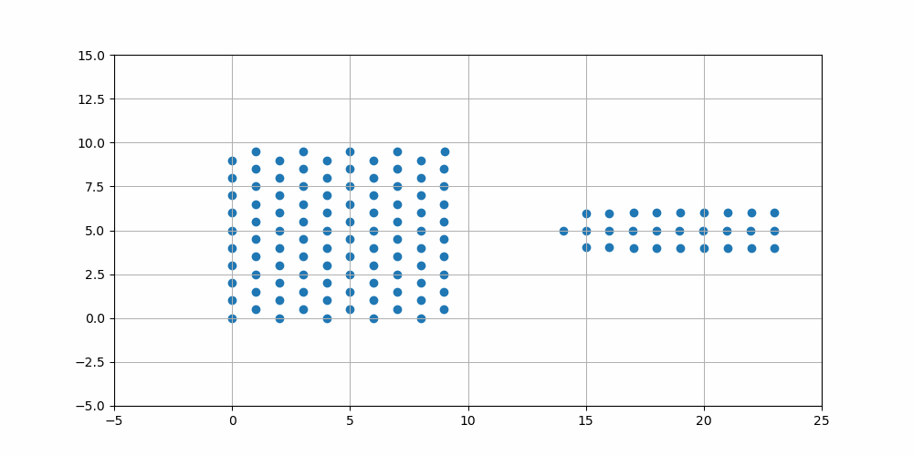

# Метод взаимодействия между частицами
В данной работе реализован метод взаимодействия между частицами, используемый в механике дискретных сред. Решается следующая система уравнений:
$$m\dot{v}=F$$
$$\dot{x}=v$$
Численная схема реализации:
$$v_{i+1}=v_{i}+\frac{F(t_i)}{m} \Delta t$$
$$x_{i+1}=x_i+v_{i+1} \Delta t$$
Предполагается, что частицы могут взаимодействовать друг с другом, если находятся на расстоянии ближе чем $\sqrt{2}$.
Для взаимодействия между частицами рассматривается упругий потенциал $F=c(x-l)$, где $c$ - жесткость, $x$ - расстояние между частицами, $l$ - равновесное расстояние.
Запуск программы производится из консоли:
```sh
mpiexec –n <number of processing elements> ./x64/Debug/ParticleMethod.exe
```
## Результат



